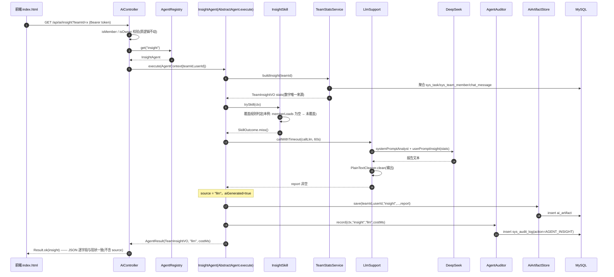
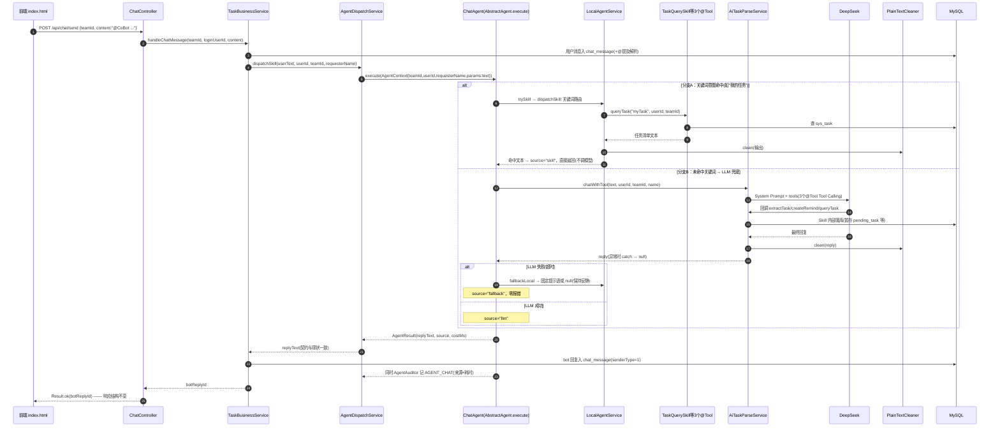
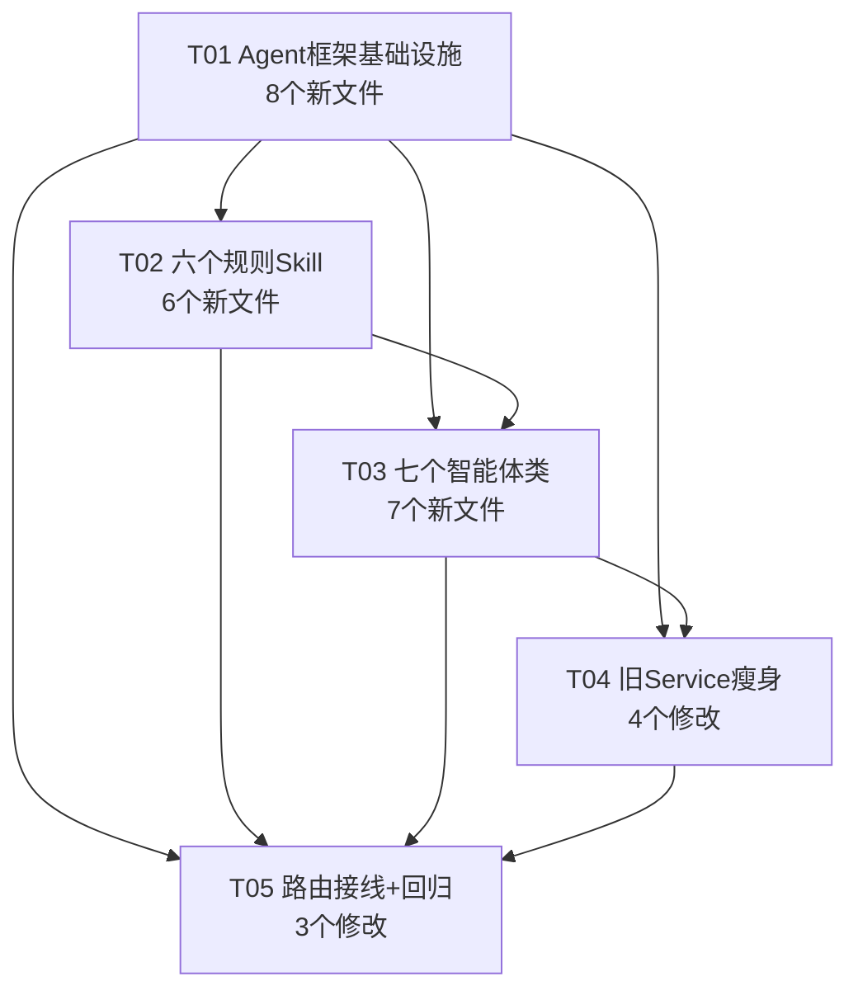

# CoBot-v2 AI 层架构重构 —— 实现方案与任务分解

- **文档版本**：v1.0
- **作者**：Bob / 高见远（架构师）
- **输入**：`docs/prd-agent-refactor.md`（Alice，v1.0）+ 主理人六条决议（Q1~Q6）
- **状态**：待主理人评审，评审通过后交工程师实施
- **红线基线**：`index.html` 一行不改；13 个 `/api/ai/**` 端点逐字段兼容；LLM 输出必经 `PlainTextCleaner`；数字仅出自 `TeamStatsService`；DeepSeek 全挂时 7 能力零报错；单智能体类 ≤ 300 行；零新增第三方依赖

---

## 一、实现方案

### 1.1 难点分析与总体思路

| 难点 | 分析 | 对策 |
|------|------|------|
| 生成逻辑深埋在 816 行的 `AiContentService` 与 550 行的 `AiExtendService` | 生成方法与历史/详情/文件方法、`saveArtifact`、`callLlm`、`parseJson` 等工具方法混在一起 | 新增 `com.cobot.agent` 包放 7 个智能体 + 框架 3 件套；生成逻辑整体搬迁（提示词、local 模板原样保留）；两个旧 Service 只删生成方法，查询/文件方法原地保留 |
| 对外接口零改动 | `AiController` 响应体多一个字段都算破坏 | 智能体返回值用内部包装类 `AgentResult<T>` 携带来源标记，Controller 只取 `.data()`，响应 JSON 逐字段不变 |
| Skill 命中判定 | 不能引入模型判定（Q1 决议） | 每个智能体的 Skill 定义**纯规则覆盖条件**（见 1.5 覆盖规则表）：输入不可解析 / 输出缺必需字段 = 未覆盖 |
| DeepSeek 全挂零报错 | 现状 `chatWithTool` 异常会抛到 `GlobalExceptionHandler`（聊天链路会报错气泡） | `AbstractAgent.execute` 统一 try/catch LLM 调用并叠加 JDK 自带超时（`CompletableFuture` + `get(timeout)`），异常/超时一律落 `fallbackLocal` |
| 两个 Service 各有一份 `saveArtifact` / `callLlm` / `parseJson` | 拆分后 7 个智能体都需要落库产物 | 抽一个共享组件 `AiArtifactStore`（落库）+ `LlmSupport`（调模型、解析 JSON），智能体与旧 Service 共用，避免复制 6 份 |
| 聊天智能体契约特殊（回复可为 null = 保持安静） | 三段式骨架必须兼容"未覆盖→null"语义 | `ChatAgent.fallbackLocal` 允许返回 null；`AbstractAgent` 对 String 型结果不做"null 即失败"强转，由子类钩子自己决定 |

总体架构模式：**模板方法（AbstractAgent 固化三段式骨架）+ 注册表路由（AgentRegistry）**，Spring 构造注入，无任何新框架。

### 1.2 新增包结构与文件布局

```
com.cobot.agent/                    ← 新增包（框架 + 7 个智能体）
├── AbstractAgent.java              三段式骨架基类（模板方法）
├── AgentContext.java               请求上下文（teamId/userId/requesterName + 参数表）
├── AgentResult.java                内部结果包装（data + source + costMs）
├── AgentRegistry.java              注册表（name → agent 路由）
├── AgentAuditor.java               来源标记落日志 + sys_audit_log（Q4 决议）
├── ChatAgent.java                  聊天室智能体（承接 AiTaskParseService + LocalAgentService）
├── InsightAgent.java               团队洞察
├── PlanAgent.java                  项目计划
├── PptAgent.java                   演示文稿（Q2 例外：Skill 骨架 + LLM 润色）
├── MeetingAgent.java               会议纪要拆任务
├── WeeklyAgent.java                团队周报
└── AskAgent.java                   团队数据问答

com.cobot.skill/                    ← 既有 3 个 @Tool 不动，新增 6 个规则 Skill
├── InsightSkill.java               基于 TeamStatsService 聚合结果直接拼装洞察结论
├── PlanSkill.java                  场景关键词 → 内置计划模板
├── PptSkill.java                   通用 PPT 骨架（封面/目录/content/end）
├── MeetingSkill.java               纪要按行拆任务（承接 parseTasksLocal 逻辑）
├── WeeklySkill.java                统计快照 → 周报模板（承接 localWeeklyReport 逻辑）
└── AskSkill.java                   高频问答意图规则（承接 localAnswer 逻辑）

com.cobot.service/                  ← 共享组件下沉 + 旧 Service 瘦身
├── AiArtifactStore.java            新增：ai_artifact 落库统一入口（save 一族）
└── LlmSupport.java                 新增：ChatClient 调用 + JSON 解析（callLlm/parseJson/extractJson）
```

### 1.3 核心框架设计

#### 1.3.1 `AbstractAgent` 基类（模板方法，预估 ~150 行）

```java
public abstract class AbstractAgent<T> {

    @Resource protected AgentAuditor auditor;
    @Resource protected LlmSupport llm;

    /** 注册键（AgentRegistry 路由用）：chat/insight/plan/ppt/meeting/weekly/ask */
    protected abstract String name();

    /** 钩子一：Skill 尝试。返回 SkillOutcome.hit()=true 表示覆盖本次请求 */
    protected abstract SkillOutcome<T> trySkill(AgentContext ctx);

    /** 钩子二：模型兜底。只写提示词与调 LlmSupport；返回 null 视为失败 */
    protected abstract T callLlm(AgentContext ctx);

    /** 钩子三：local 模板降级。DeepSeek 异常/超时/关闭时必须给出合法结果（ChatAgent 可返回 null=不回复） */
    protected abstract T fallbackLocal(AgentContext ctx);

    /** 本智能体 LLM 兜底超时秒数，默认 60（P2-1 差异化超时的预留点） */
    protected int llmTimeoutSeconds() { return 60; }

    /** LLM 是否可用（agent.mode=local 或未配 Key 时为 false，直接跳过兜底） */
    protected boolean llmAvailable() { ... }   // 读 agent.mode

    /** Q2 例外点：Skill 命中后的润色钩子，默认原样返回；仅 PptAgent 覆盖 */
    protected T polish(T skillData, AgentContext ctx) { return skillData; }

    /** 三段式骨架（final，子类不得改顺序） */
    public final AgentResult<T> execute(AgentContext ctx) {
        long start = System.currentTimeMillis();
        T data = null; String source;
        try {                                                    // 1. Skill 尝试（Skill 异常视为未覆盖）
            SkillOutcome<T> s = trySkill(ctx);
            if (s != null && s.hit()) data = polish(s.data(), ctx);
        } catch (Exception e) { /* log.warn，视为未覆盖 */ }
        if (data != null) {
            source = AgentSource.SKILL.label();
        } else {                                                 // 2. 模型兜底（异常/超时→null）
            T llmData = null;
            if (llmAvailable()) {
                llmData = llm.callWithTimeout(() -> callLlm(ctx), llmTimeoutSeconds());
            }
            if (llmData != null) { data = llmData; source = AgentSource.LLM.label(); }
            else {                                               // 3. local 模板降级
                data = fallbackLocal(ctx); source = AgentSource.FALLBACK.label();
            }
        }
        long costMs = System.currentTimeMillis() - start;
        auditor.record(ctx, name(), source, costMs);             // Q4：只进日志 + sys_audit_log
        return new AgentResult<>(data, source, costMs);
    }
}
```

`SkillOutcome<T>`：内部静态小类（放在 `AgentResult` 同文件或独立 ~20 行文件），两个字段 `boolean hit; T data;` + 静态工厂 `SkillOutcome.hit(data)` / `SkillOutcome.miss()`。

#### 1.3.2 `AgentContext`（~60 行）

承载一次生成请求的全部输入，避免每个钩子方法带一串参数：

```java
public class AgentContext {
    private final Long teamId;            // 必填
    private final Long userId;            // 发起人（落库产物用）
    private final String requesterName;   // 发起人昵称（聊天/计划分配用）
    private final Map<String, Object> params;   // topic/weeks/slideCount/scene/theme/notes/question 等
    // 提供 params.put 链式注册 + 类型化取值：str("topic")、int("weeks", 4)、req("topic") 等
}
```

#### 1.3.3 `AgentResult<T>`（~25 行）与 `AgentSource`（枚举，~15 行）

```java
public record AgentResult<T>(T data, String source, long costMs) { }  // source ∈ skill/llm/fallback
```

`AgentSource` 枚举：`SKILL("skill") / LLM("llm") / FALLBACK("fallback")`。**只在 Service 层内部与日志/审计里流转，绝不进响应体**。

#### 1.3.4 `AgentRegistry`（~50 行）

- 注册方式：构造注入 `List<AbstractAgent<?>>`（Spring 自动收集全部智能体 Bean），按 `name()` 建 `Map<String, AbstractAgent<?>>`；
- 路由：`AbstractAgent<?> get(String name)`（查不到抛 `IllegalArgumentException`，被 `GlobalExceptionHandler` 兜住）、`boolean exists(String name)`；
- 新增第 8 个能力 = 新增一个 `AbstractAgent` 子类 Bean + 注册一行（P1-1 验收标准）。

#### 1.3.5 `AgentAuditor`（~60 行，Q4 决议的落点）

- 依赖 `AuditService.record(teamId, userId, username, action, target, detail, ip)`（已核实签名，审计异常自动吞掉不影响主流程）；
- action 命名：`AGENT_INSIGHT` / `AGENT_PLAN` / `AGENT_PPT` / `AGENT_MEETING` / `AGENT_WEEKLY` / `AGENT_ASK` / `AGENT_CHAT`；
- detail 格式：`来源=skill 耗时=123ms`（skill/llm/fallback）；
- 同时打一行 `log.info("[Agent:{}] source={} costMs={}", ...)` 供日志检索；
- ip 传 null（生成类请求与审计切面的取值口径不同，保持简单）。

#### 1.3.6 `LlmSupport`（~90 行，共享 LLM 工具）

从 `AiContentService` / `AiExtendService` 提取共性：

- `String callLlm(String systemPrompt, String userPrompt)`：调 `ChatClient`，任何异常返回 null（保留原有两个 Service 的容错语义）；
- `<T> T parseJson(String raw, Class<T> clazz)` / `List<T> parseJsonArray(String raw, TypeReference<T>)`：剥离 ``` 围栏与前后废话后反序列化，失败返回 null/空表（承接 `extractJson` / `extractJsonArray`）;
- `String toJson(Object obj)`；
- `T callWithTimeout(Supplier<T> task, int seconds)`：`CompletableFuture.supplyAsync(task).get(seconds, SECONDS)`，异常/超时返回 null（仅被 `AbstractAgent` 兜底段使用；Skill 段不走超时）；
- 持有 `ChatClient`（`ChatClient.Builder` 构造注入 `builder.build()`，temperature 等沿用 yml 现有配置）。

#### 1.3.7 ChatClient 注入与超时策略（汇总）

| 项 | 方案 |
|----|------|
| ChatClient 构建 | 全工程只保留 3 处 `builder.build()`：`LlmSupport`（新增）、`AiTaskParseService`（保留，聊天 LLM 兜底用）、`AiExtendService`（保留 `pushWeeklyToChat` 无需 LLM 后可移除，见 2.2 修改清单） |
| 兜底调用出口 | 一律经 `AbstractAgent` 兜底段 → `LlmSupport.callWithTimeout`，异常/超时统一降级 |
| 超时 | JDK `CompletableFuture` + `get(seconds)`，默认 60s，`llmTimeoutSeconds()` 可按智能体覆盖（本期全部用默认值，P2-2 再差异化） |
| 重试 | 本期不做（保持现状语义：失败即降级），P2-2 预留 |
| 开关 | `agent.mode` 语义不变：`local` → `llmAvailable()=false`，7 个智能体直接走 Skill（Skill 未覆盖也直接 local 模板，不调模型）——与现状 local 模式行为一致 |

### 1.4 三段式调用链与 PPT 例外（Q2）

```
请求 → Controller → AgentRegistry.get(能力名) → AbstractAgent.execute
      ├─ ① trySkill        Skill 覆盖规则见 1.5；Skill 抛异常 = 未覆盖
      │     └─ 命中 → polish()（仅 PPT：骨架交给 LLM 润色；润色失败保留骨架，source=skill）
      ├─ ② callLlm         未命中时才调 DeepSeek（异常/超时/agent.mode=local → 跳过）
      └─ ③ fallbackLocal   local 模板直出（已是纯文本，不再清洗）；ChatAgent 允许 null=不回复
```

- local 模板直出**不经过** `PlainTextCleaner`（模板本身已是干净文本，与现状一致）；LLM 输出（含 PPT 润色结果）在子类 `callLlm`/`polish` 返回前必经 `PlainTextCleaner.clean`；
- 数字类内容：Skill 与 LLM 的提示词/拼装全部以 `TeamStatsService.buildInsight()` 快照为唯一数据源，LLM 只写叙述文字。

### 1.5 各智能体挂载 Skill 与覆盖规则表（Q1 纯规则判定）

| 智能体 | 挂载 Skill | Skill 覆盖条件（hit） | 未覆盖 → LLM 兜底 | LLM 兜底再失败 → fallback |
|--------|-----------|----------------------|-------------------|--------------------------|
| `ChatAgent` | 复用现有 3 个 `@Tool`（TaskExtract/TaskQuery/Remind）作为第一段（Q6） | 命中关键词意图：我的任务/未完成任务/查询类/提醒我/@CoBot 任务提取（承接 `LocalAgentService.dispatchSkill` 全部规则） | `AiTaskParseService.chatWithTool`（继续挂载 3 个 @Tool 做 Tool Calling） | 固定提示语（"请按 @CoBot 负责人 时间 事项 创建任务"），或 null 保持安静 |
| `InsightAgent` | `InsightSkill`（新增） | `TeamStatsService.buildInsight` 返回非 null 且 memberLoads 已算出 → 直接拼装结论（承接现 `buildLocalReport`） | 现有洞察提示词（systemPromptAnalyst + userPromptInsight） | `buildLocalReport` 模板 |
| `PlanAgent` | `PlanSkill`（新增） | topic 命中内置场景关键词（研发/开发、活动、学习/培训等）→ 产出对应模板计划（含 stages/tasks/advice，承接现 `localPlan`） | 现有计划提示词（要求输出 JSON） | `localPlan` 通用模板 |
| `PptAgent` | `PptSkill`（新增，Q2 例外） | 恒定产出通用骨架（承接现 `localOutline`）；骨架必命中 | **润色路径**：骨架 + 现有 PPT 提示词交给 LLM 逐页润色；润色失败保留 Skill 骨架（source=skill） | LLM 完全不可用 → Skill 骨架直出（即现 `localOutline`，天然零报错） |
| `MeetingAgent` | `MeetingSkill`（新增） | notes 按行拆分能解析出 ≥1 条任务（承接现 `parseTasksLocal`） | 现有纪要拆任务提示词（JSON 数组） | `parseTasksLocal` 模板 + fallbackNote 文案 |
| `WeeklyAgent` | `WeeklySkill`（新增） | 统计快照非 null → 模板周报（承接现 `localWeeklyReport`） | 现有周报提示词 | `localWeeklyReport` 模板 |
| `AskAgent` | `AskSkill`（新增） | question 命中高频意图关键词（逾期/谁忙/完成率/待审批/成员，承接现 `localAnswer`） | 现有问答提示词（只能依据给定数据） | `localAnswer` 统计摘要 |

> 命中判定全部是**关键词/结构规则**（Q1：不引入模型判定）。`WeeklySkill`/`PptSkill` 恒命中，因此这两个能力平时基本不调 LLM——这正是"降低大模型调用量"的产品目标；`AskSkill`/`MeetingSkill`/`PlanSkill` 未覆盖时 LLM 照常生效，开放性问题仍由 DeepSeek 回答。

### 1.6 聊天链路的并入方式（Q3、Q6）

- `AgentDispatchService` 保留为聊天专用入口，方法签名不变（`TaskBusinessService` 无感）：
  - `dispatchSkill(userText, userId, teamId, requesterName)` → `chatAgent.execute(ctx).data()`；
  - `isLlmMode()`、`parseTaskFromText(...)` 原样保留（`parseTaskFromText` 现无调用方，属遗留兼容，一并委托给 `ChatAgent` 的对应委托方法，不删）；
- `ChatAgent.trySkill` 直接复用 `LocalAgentService` 的关键词路由逻辑（将 `LocalAgentService.dispatchSkill` 主体迁入 `ChatAgent`，`LocalAgentService` 保留为 ChatAgent 的委托对象亦可——采用**委托**方式：`ChatAgent` 持有 `LocalAgentService`，保证 chat 行为与现状 local 模式逐字一致）；
- `ChatAgent.callLlm` 委托 `AiTaskParseService.chatWithTool`（3 个 @Tool 照常挂载，Q6）；LLM 异常从"抛给 GlobalExceptionHandler 报错气泡"改为"骨架兜底"，这是行为增强而非破坏（红线 4 要求）。

### 1.7 旧 Service 瘦身（Q5 决议）

- `AiContentService`（816 行 → 约 300 行）：删除 `generateInsight` / `generatePlan` / `generatePpt` / `callLlm` / `parseJson` / `extractJson` / `toJson` / `localPlan` / `localOutline` / 两个 prompt 族私有方法 / `sanitizePlan` / `sanitizeOutline` / `normalizeOutline`（后四者随生成逻辑迁入 `PlanAgent`/`PptAgent`）；**保留** `importPlanTasks`（纯 DB 编排）、`history` / `detail` / `fileBytes` / `memberNames` / `username` / `typeName`；`saveArtifact` 迁入 `AiArtifactStore`，此处调用之；
- `AiExtendService`（550 行 → 约 250 行）：删除 `parseMeeting` / `generateWeekly` / `askTeam` / `parseTasksByLlm` / `parseTasksLocal` / `localWeeklyReport` / `localAnswer` / `callLlm` / `extractJsonArray` / `toJson` 及相关 prompt；**保留** `importMeetingTasks` / `pushWeeklyToChat`（含 `fromJsonList` / `firstLineTopic`）；`saveArtifact` 迁入 `AiArtifactStore`；ChatClient 构造器依赖随之移除；
- `AiController`：6 个生成端点的调用目标从两个 Service 换成 `AgentRegistry` 路由（insight/plan/ppt/meeting/weekly/ask），URL、`@AuditLog`、权限校验、record 请求体、返回类型**全部不动**；history/detail/file/themes/import/push 等端点调用关系不变；
- `TaskBusinessService`、`AgentDispatchService` 对外签名零改动。

---

## 二、文件清单

### 2.1 新增文件（14 个，全部为本次重构新写）

| 相对路径 | 预估行数 | 职责 |
|----------|---------|------|
| `src/main/java/com/cobot/agent/AbstractAgent.java` | ~150 | 三段式模板方法骨架（trySkill→callLlm→fallbackLocal）+ polish 钩子 + 超时兜底 + 审计埋点 |
| `src/main/java/com/cobot/agent/AgentContext.java` | ~60 | 请求上下文：teamId/userId/requesterName + 参数表 + 类型化取值 |
| `src/main/java/com/cobot/agent/AgentResult.java` | ~30 | 内部结果包装 record(data, source, costMs) + `SkillOutcome<T>` 内嵌类（hit/miss 工厂） |
| `src/main/java/com/cobot/agent/AgentSource.java` | ~15 | 来源枚举 skill/llm/fallback |
| `src/main/java/com/cobot/agent/AgentRegistry.java` | ~50 | 按 name() 注册/路由 7 个智能体 |
| `src/main/java/com/cobot/agent/AgentAuditor.java` | ~60 | 来源标记 → log.info + `AuditService.record`（action=AGENT_*，detail=来源+耗时） |
| `src/main/java/com/cobot/agent/ChatAgent.java` | ~120 | 聊天智能体：trySkill 委托 LocalAgentService；callLlm 委托 AiTaskParseService.chatWithTool；fallback 固定提示/null |
| `src/main/java/com/cobot/agent/InsightAgent.java` | ~180 | 洞察三段式（prompt 与 local 报告模板自 AiContentService 迁入） |
| `src/main/java/com/cobot/agent/PlanAgent.java` | ~260 | 计划三段式（prompt/localPlan/buildPeriods/sanitizePlan 迁入） |
| `src/main/java/com/cobot/agent/PptAgent.java` | ~280 | PPT 三段式 + polish 润色例外（prompt/localOutline/normalizeOutline/sanitizeOutline/safeFileName/sceneName 迁入） |
| `src/main/java/com/cobot/agent/MeetingAgent.java` | ~180 | 纪要三段式（prompt 与 fallbackNote 迁入） |
| `src/main/java/com/cobot/agent/WeeklyAgent.java` | ~160 | 周报三段式（prompt 与周期字段迁入） |
| `src/main/java/com/cobot/agent/AskAgent.java` | ~130 | 问答三段式（prompt 迁入） |
| `src/main/java/com/cobot/skill/InsightSkill.java` | ~70 | TeamStatsService 聚合 → 洞察结论拼装 |
| `src/main/java/com/cobot/skill/PlanSkill.java` | ~140 | 场景关键词 → 内置计划模板（承接 localPlan 骨架） |
| `src/main/java/com/cobot/skill/PptSkill.java` | ~120 | 通用 PPT 骨架（承接 localOutline 骨架） |
| `src/main/java/com/cobot/skill/MeetingSkill.java` | ~110 | 纪要按行拆任务（承接 parseTasksLocal） |
| `src/main/java/com/cobot/skill/WeeklySkill.java` | ~90 | 统计快照 → 周报模板（承接 localWeeklyReport） |
| `src/main/java/com/cobot/skill/AskSkill.java` | ~100 | 高频问答意图规则（承接 localAnswer） |
| `src/main/java/com/cobot/service/AiArtifactStore.java` | ~80 | `save(teamId,userId,genType,topic,content)` 与 `saveWithFile(...含 theme/fileName/fileBytes/filePath 外置落盘)`，承接两处 saveArtifact 合并 |
| `src/main/java/com/cobot/service/LlmSupport.java` | ~90 | callLlm / parseJson / parseJsonArray / extractJson / toJson / callWithTimeout；持有 ChatClient |

> 注：清单按"每个智能体一个类 + 每个能力一个 Skill"列出，共 14 个 java 文件（agent 包 12 + skill 包 6 + service 包 2 = 20 条目中，`AgentSource` 与 `AgentResult` 可合并实现；实施时若合并，以不超过 300 行/文件为前提，条目数允许 ±2 浮动，职责边界不变）。

### 2.2 修改文件（6 个）

| 相对路径 | 改动内容 |
|----------|---------|
| `controller/AiController.java` | 仅改 6 个生成端点的方法体调用目标：`aiContentService.generateInsight(...)` → `agentRegistry.get("insight").execute(ctx)` 等；**端点 URL、请求/响应类型、@AuditLog、权限校验逐字不动**；注入项增加 `AgentRegistry`，保留 `AiContentService`/`AiExtendService`（历史/详情/导入/推送仍在用） |
| `service/AiContentService.java` | 删生成族方法（见 1.7）；`saveArtifact` 改为调用 `AiArtifactStore`；`history/detail/fileBytes/importPlanTasks/memberNames/username/typeName` 保留；移除 `agentDispatchService` 依赖与 `ChatClient` 构造器 |
| `service/AiExtendService.java` | 删生成族方法（见 1.7）；保留 `importMeetingTasks/pushWeeklyToChat/fromJsonList/firstLineTopic`；移除 `ChatClient` 构造器与 `agentMode` 字段（不再判断模式）；`saveArtifact` 改为调用 `AiArtifactStore` |
| `service/AgentDispatchService.java` | `dispatchSkill` 内部改为委托 `ChatAgent.execute(...)` 并取 `.data()`；`isLlmMode()` 保留；`parseTaskFromText` 改为委托 `ChatAgent` 的同签名方法；对 `TaskBusinessService` 的可见行为零变化 |
| `service/AiTaskParseService.java` | 仅删掉不再需要的注释性冗余（如双模式兼容说明），`chatWithTool` / `parseTaskFromText` / 3 个 @Tool 挂载、System Prompt 原样保留；异常语义变化：`chatWithTool` 内部 catch 后返回 null（不再上抛，红线 4） |
| `service/LocalAgentService.java` | 不改对外行为；若 `ChatAgent` 采用委托方式则本文件**零改动**（推荐）；`@Resource public TaskExtractSkill` 字段可见性收窄为 private（唯一允许的微调） |

### 2.3 不动的文件（红线相关）

| 文件 | 不动的理由 |
|------|-----------|
| `resources/static/index.html` | 红线 1：一行不改 |
| `controller/ChatController.java` | 聊天链路对上契约（`TaskBusinessService.handleChatMessage` 返回 Long）不变 |
| `service/TaskBusinessService.java` | 只依赖 `AgentDispatchService`，签名未变 |
| `util/PlainTextCleaner.java` | 清洗收口原样复用（附 178 行单测继续有效） |
| `service/TeamStatsService.java` | 数字唯一来源，含 `buildInsight/toPromptText/buildLocalReport` |
| `service/PptxBuildService.java` | POI 渲染继续由 `PptAgent` 调用 |
| `skill/TaskExtractSkill.java`、`skill/TaskQuerySkill.java`、`skill/RemindSkill.java` | Q6：兜底挂载 + ChatAgent 第一段，原样复用 |
| `controller/TaskController/TeamController/CommonController/AuthController`、`dto/*`、`entity/*`、`mapper/*`、`aspect/*`、`config/*` | 与本次重构无交集 |
| `pom.xml` | 零新增第三方依赖（CompletableFuture 为 JDK 自带） |
| `resources/application.yml` | 本期不改（P2-1/P2-2 的配置项下期再加） |

---

## 三、类图与时序图

### 3.1 类图（Mermaid classDiagram）

```mermaid
classDiagram
    direction TB

    class AbstractAgent~T~ {
        <<abstract>>
        #AgentAuditor auditor
        #LlmSupport llm
        +execute(AgentContext ctx) AgentResult~T~
        +name() String
        #trySkill(AgentContext ctx)* SkillOutcome~T~
        #callLlm(AgentContext ctx)* T
        #fallbackLocal(AgentContext ctx)* T
        #polish(T skillData, AgentContext ctx) T
        #llmTimeoutSeconds() int
        #llmAvailable() boolean
    }

    class AgentContext {
        -Long teamId
        -Long userId
        -String requesterName
        -Map~String,Object~ params
        +str(key) String
        +int$(key, def) int
        +req(key) String
    }

    class AgentResult~T~ {
        <<record>>
        +T data
        +String source
        +long costMs
    }

    class SkillOutcome~T~ {
        +boolean hit
        +T data
        +hit(data)$ SkillOutcome~T~
        +miss()$ SkillOutcome~T~
    }

    class AgentSource {
        <<enumeration>>
        SKILL
        LLM
        FALLBACK
    }

    class AgentRegistry {
        -Map~String,AbstractAgent~ agents
        +get(name) AbstractAgent
        +exists(name) boolean
    }

    class AgentAuditor {
        -AuditService auditService
        +record(ctx, agentName, source, costMs) void
    }

    class LlmSupport {
        -ChatClient chatClient
        +callLlm(system, user) String
        +callWithTimeout(task, seconds) T
        +parseJson(raw, clazz) T
        +parseJsonArray(raw, typeRef) List~T~
        +toJson(obj) String
    }

    class AiArtifactStore {
        +save(teamId, userId, genType, topic, content) Long
        +saveWithFile(teamId, userId, genType, topic, theme, content, fileName, fileBytes) Long
    }

    class ChatAgent {
        -LocalAgentService localAgentService
        -AiTaskParseService llmChatService
        +trySkill(ctx) SkillOutcome~String~
        +callLlm(ctx) String
        +fallbackLocal(ctx) String
    }
    class InsightAgent {
        -TeamStatsService teamStatsService
        -InsightSkill insightSkill
        -AiArtifactStore artifactStore
    }
    class PlanAgent {
        -PlanSkill planSkill
        -AiArtifactStore artifactStore
    }
    class PptAgent {
        -PptSkill pptSkill
        -PptxBuildService pptxBuildService
        -AiArtifactStore artifactStore
        +polish(skillData, ctx) PptOutlineVO
    }
    class MeetingAgent {
        -MeetingSkill meetingSkill
        -AiArtifactStore artifactStore
    }
    class WeeklyAgent {
        -TeamStatsService teamStatsService
        -WeeklySkill weeklySkill
        -AiArtifactStore artifactStore
    }
    class AskAgent {
        -TeamStatsService teamStatsService
        -AskSkill askSkill
        -AiArtifactStore artifactStore
    }

    class AiController {
        +insight(plan, ppt, meeting, weekly, ask)
    }
    class AgentDispatchService {
        -ChatAgent chatAgent
        +dispatchSkill(text, userId, teamId, name) String
    }
    class AiContentService {
        +history(teamId) List~ArtifactVO~
        +detail(artifactId) AiArtifact
        +fileBytes(artifactId) byte[]
        +importPlanTasks(...) String
    }
    class AiExtendService {
        +importMeetingTasks(...) String
        +pushWeeklyToChat(...) String
    }
    class TaskBusinessService {
        +handleChatMessage(teamId, userId, msg) Long
    }

    AbstractAgent <|.. ChatAgent : implements
    AbstractAgent <|.. InsightAgent
    AbstractAgent <|.. PlanAgent
    AbstractAgent <|.. PptAgent
    AbstractAgent <|.. MeetingAgent
    AbstractAgent <|.. WeeklyAgent
    AbstractAgent <|.. AskAgent
    AbstractAgent *-- AgentContext : 参数载体
    AbstractAgent ..> AgentResult : 返回
    AgentResult ..> AgentSource : source 标记
    AgentResult *-- SkillOutcome : Skill 段产物
    AgentRegistry o-- AbstractAgent : 注册 7 个
    AbstractAgent --> AgentAuditor : execute 收尾记来源
    AgentAuditor --> LlmSupport : 无依赖(仅示意解耦)
    AbstractAgent --> LlmSupport : 兜底调用
    InsightAgent --> AiArtifactStore : 落库产物
    PptAgent --> AiArtifactStore : 落库产物(含 pptx 字节)
    AiController ..> AgentRegistry : 6 个生成端点路由
    AiController --> AiContentService : history/detail/file/import
    AiController --> AiExtendService : import/push
    AgentDispatchService --> ChatAgent : 聊天路由
    TaskBusinessService --> AgentDispatchService
    PptAgent --> LlmSupport : 润色
```



### 3.2 时序图一：洞察请求（Skill 未命中 → LLM 兜底 → 成功）



### 3.3 时序图二：聊天室消息（Skill 命中 / 未命中两分支）



> 时序图中 `plainTextCleaner` 清洗均发生在"返回前端/入库之前"；Skill 命中段文本（模板直出）同样过清洗（现状即如此：`LocalAgentService`、`TaskQuerySkill` 等已在出口处 clean），保持逐行为兼容。

---

## 四、任务分解

### 4.1 所需依赖包

**零新增第三方依赖**（红线）。全部复用现有：Spring Boot 3.4.5 / SpringAI 1.0.0 / MyBatis-Plus 3.5.7 / Apache POI 5.2.5 / Lombok / Jackson。超时控制用 JDK 自带 `java.util.concurrent.CompletableFuture`，不引入 Resilience4j/Sentinel 等。

### 4.2 任务列表（按依赖顺序，共 5 个任务）

#### T01：Agent 框架基础设施

- **任务 ID**：T01　**优先级**：P0　**依赖**：无
- **新增文件**（8 个）：
  - `agent/AgentSource.java`（来源枚举）
  - `agent/AgentResult.java`（结果包装 + `SkillOutcome` 内嵌类）
  - `agent/AgentContext.java`（上下文 + 类型化参数取值）
  - `agent/AbstractAgent.java`（三段式模板方法骨架，含 polish 钩子 / llmTimeoutSeconds / llmAvailable）
  - `agent/AgentRegistry.java`（注入 `List<AbstractAgent<?>>` 自动收集 + 路由）
  - `agent/AgentAuditor.java`（log.info + `AuditService.record`，action=AGENT_*）
  - `service/LlmSupport.java`（callLlm/parseJson/callWithTimeout，持有 ChatClient）
  - `service/AiArtifactStore.java`（save / saveWithFile，合并两处 saveArtifact）
- **实现要点**：按 1.3 节签名实现；`execute` 为 final；`AbstractAgent` 此时先留 `protected boolean llmAvailable()` 读 `@Value("${agent.mode:llm}")`；
- **完成标志**：`mvn compile` 通过；`AgentRegistry.get("未注册")` 抛 IllegalArgumentException；`LlmSupport.callWithTimeout` 用一个 sleep 假任务验证超时返回 null（可写成临时 main/单测后删除）。

#### T02：六个规则 Skill

- **任务 ID**：T02　**优先级**：P0　**依赖**：T01（Skill 输出形态需与 `SkillOutcome` 对齐）
- **新增文件**（6 个）：`skill/InsightSkill.java`、`skill/PlanSkill.java`、`skill/PptSkill.java`、`skill/MeetingSkill.java`、`skill/WeeklySkill.java`、`skill/AskSkill.java`
- **实现要点**：
  - 方法体逻辑从既有代码**原样搬迁**：`InsightSkill` ← `TeamStatsService.buildLocalReport` 的拼装（保留 buildLocalReport 本体，Skill 只做编排调用与命中判定）；`PptSkill` ← `AiContentService.localOutline`；`MeetingSkill` ← `AiExtendService.parseTasksLocal`；`WeeklySkill` ← `localWeeklyReport`；`AskSkill` ← `localAnswer`；`PlanSkill` ← `localPlan` + 场景关键词表；
  - 每个 Skill 返回 `SkillOutcome<T>`，命中条件按 1.5 覆盖规则表实现（纯关键词/结构规则，Q1）；
  - Skill 内部**不落库、不调模型、不打审计**（这些是 Agent 层职责）；
- **完成标志**：`mvn compile` 通过；每个 Skill 的命中与未覆盖分支各能构造一个用例说明（写进类 javadoc）。

#### T03：七个智能体类

- **任务 ID**：T03　**优先级**：P0　**依赖**：T01、T02
- **新增文件**（7 个）：`agent/ChatAgent.java`、`agent/InsightAgent.java`、`agent/PlanAgent.java`、`agent/PptAgent.java`、`agent/MeetingAgent.java`、`agent/WeeklyAgent.java`、`agent/AskAgent.java`
- **实现要点**：
  - 生成逻辑自 `AiContentService`/`AiExtendService` **整体搬迁**（提示词一字不改、local 模板逐行搬迁），每个类 ≤300 行；
  - `ChatAgent`：trySkill 委托 `LocalAgentService.dispatchSkill`；callLlm 委托 `AiTaskParseService.chatWithTool`；fallback 返回固定提示语或 null；name()="chat"；
  - `PptAgent`：覆盖 `polish()`（Skill 骨架 + LLM 润色，润色失败返回 skillData）；生成后调 `PptxBuildService.build` + `AiArtifactStore.saveWithFile`；name()="ppt"；
  - `InsightAgent`/`WeeklyAgent`/`AskAgent` 的数字一律取 `TeamStatsService.buildInsight` 快照；
  - 所有 LLM 出口（callLlm 返回前、polish 返回前）必经 `PlainTextCleaner.clean`；local 模板直出不清洗（与现状一致）；
- **完成标志**：`mvn compile` 通过；7 个类均 ≤300 行（wc -l 复核）；`AgentRegistry` 能收集到 7 个 Bean（启动日志或临时断言验证）。

#### T04：旧 Service 瘦身

- **任务 ID**：T04　**优先级**：P0　**依赖**：T01（改用 AiArtifactStore/LlmSupport）、T03（生成逻辑确认已迁出后才能删）
- **修改文件**（4 个）：
  - `service/AiContentService.java`：删生成族（1.7 清单），保留 history/detail/fileBytes/importPlanTasks；saveArtifact 调用点改走 `AiArtifactStore`；删 ChatClient 构造器与 agentDispatchService 依赖；
  - `service/AiExtendService.java`：删生成族（1.7 清单），保留 importMeetingTasks/pushWeeklyToChat；删 ChatClient/agentMode；
  - `service/AiTaskParseService.java`：`chatWithTool` 内部 catch 全部异常返回 null（不再上抛 GlobalExceptionHandler）；其余原样；
  - `service/LocalAgentService.java`：推荐零改动（ChatAgent 委托方式）；仅允许 `public TaskExtractSkill` 字段收窄为 private。
- **完成标志**：`mvn compile` 通过；`mvn test` 全绿（PlainTextCleanerTest 等 4 个既有单测不受影响）；全工程 `grep -n "generateInsight|generatePlan|generatePpt|parseMeeting|generateWeekly|askTeam"` 只命中 agent 包。

#### T05：路由接线 + 全链路回归

- **任务 ID**：T05　**优先级**：P0　**依赖**：T01、T02、T03、T04
- **修改文件**（3 个）：
  - `controller/AiController.java`：6 个生成端点改走 `AgentRegistry`（URL/请求响应/注解/校验逐字不动）；
  - `service/AgentDispatchService.java`：`dispatchSkill`/`parseTaskFromText` 委托 ChatAgent，对外签名不变；
  - `docs/file-structure.md`：代码地图更新（新包 agent/、新 Skill、两个 Service 行数复核）。
- **完成标志（回归红线逐条验证）**：
  1. 服务启动无报错，Swagger 13 个端点齐全；
  2. `python test/ai_feature_test.py` 通过（端点逐字段兼容性由既有脚本背书）；
  3. `python test/qa_symbol_check.py` 通过（PlainTextCleaner 收口未绕过）；
  4. 把 `application-local.yml` 的 `AI_API_KEY` 改为无效值重启：洞察/计划/PPT/纪要/周报/问答/聊天 7 项全部正常返回（skill 或 fallback），HTTP 200、无 500（红线 4）；恢复 Key 后 LLM 链路生效；
  5. `sys_audit_log` 可查到 `AGENT_INSIGHT` 等 action、detail 含"来源= 耗时="；
  6. `index.html` 与 git 工作区对比零 diff（红线 1）。

---

## 五、任务依赖图



> 关键路径：T01 → T03 → T04 → T05；T02 可与 T03 前半段并行（同依赖 T01）。

---

## 六、共享知识（跨文件约定，工程师必读）

1. **来源标记只走内部通道**：`AgentResult.source`（skill/llm/fallback）仅存在于 Service 层内存、`log.info` 与 `sys_audit_log`；任何 HTTP 响应体（包括 Result 的 data 内层 Map）**不得新增字段**——`askTeam` 现返回 `LinkedHashMap`，重构后仍只放 artifactId/answer/aiGenerated/stats 四个键（Q4）。
2. **`aiGenerated` 字段语义自然映射**（无需改前端）：skill 命中 → false；llm 兜底 → true；fallback → false。逐字段类型与取值域与现状兼容。
3. **清洗收口规则**：LLM 输出（含 PPT 润色）返回前必经 `PlainTextCleaner.clean`；Skill/local 模板直出不清洗（但 Skill 内部若拼装了查询结果，保留现有出口 clean 调用，如 `TaskQuerySkill`）；清洗后结果不允许再被二次加工文本。
4. **数字唯一来源**：`InsightAgent`/`WeeklyAgent`/`AskAgent`/`PptAgent`（汇报场景）一律先取 `TeamStatsService.buildInsight(teamId)` 快照；提示词中原有"禁止编造数字"约束逐字保留；Skill 拼装只引用快照字段，不得自算新口径。
5. **sys_audit_log 新增 action 命名**：`AGENT_CHAT` / `AGENT_INSIGHT` / `AGENT_PLAN` / `AGENT_PPT` / `AGENT_MEETING` / `AGENT_WEEKLY` / `AGENT_ASK`（与既有 `AI_PLAN` 等 @AuditLog action 并存，前者记"执行来源+耗时"，后者记"用户操作"，互不替代）。detail 格式固定 `来源=skill|llm|fallback 耗时=<n>ms`。
6. **产物落库统一走 `AiArtifactStore`**：genType 取值沿用现常量 insight/plan/ppt/meeting/weekly/qa；PPT 用 `saveWithFile`（磁盘外置+库内兼容），其余用 `save`；topic 截断 190 字逻辑保留。
7. **null 契约**：`AgentResult.data` 允许为 null 的场景只有两个——团队不存在（Controller 现有判空逻辑不变）、ChatAgent 保持安静（fallback 返回 null）。其余场景 fallbackLocal 必须产出合法对象。
8. **日志前缀**：智能体日志统一 `log.info/warn("[Agent:{}] ...", name(), ...)`，便于按智能体检索 Skill 命中率（P1-2 验收）。
9. **单文件行数红线**：任何智能体类 ≤300 行；若 PptAgent 超限，优先把提示词常量下沉到 Skill 或工具类，不得砍功能。

---

## 七、待明确事项（设计中发现的技术矛盾/风险，需求边界未动）

1. **【行为变化，请知悉】Skill 优先会显著降低 LLM 使用率**：按 1.5 覆盖规则表，`WeeklySkill`/`PptSkill` 恒命中，`InsightSkill` 在统计快照正常时命中——即洞察/周报平时将返回模板文案（`aiGenerated=false`），DeepSeek 只在数据异常或 Skill 未覆盖时介入。这与 PRD 产品目标（降调用量、离线可用）一致，但与现状"insight/weekly 默认出 AI 文案"的体感不同。若产品上希望"模板只在 LLM 不可用时兜底"，需把这两个智能体的覆盖规则改为恒不命中（一行规则的事），**我未擅自改需求，按 PRD 的 Skill 优先实现了**。
2. **【轻微软化】`AiTaskParseService.chatWithTool` 异常语义变化**：现状 DeepSeek 挂掉时聊天链路会抛 `NonTransientAiException` → `GlobalExceptionHandler` 返回 `Result.fail`（前端弹错误气泡）；重构后改为 ChatAgent 内部消化 → fallback 固定提示语。这是红线 4（零报错）的必然要求，但意味着聊天链路失败不再有"显式错误提示"，只体现为 bot 的一句通用回复或不回复。
3. **【兼容性确认】`PlanSkill` 的场景关键词表**：PRD 未规定计划模板按主题分类的粒度。我按"研发/活动/学习等 3~4 个场景关键词 + 通用兜底"设计；关键词未命中的主题走 LLM。关键词表内容（哪些算命中）工程师可自行扩充，不构成需求变更。
4. **【已核实的非问题】`AgentDispatchService.parseTaskFromText` 现无调用方**（全工程 grep 仅定义与自引用），属遗留 API；按"保留签名、委托 ChatAgent"处理，不删除，避免误伤潜在调用。
5. **【环境风险】回归脚本依赖本地 MySQL 与演示账号**（20230001~20230004，登录载荷字段 `account`）：T05 的完成标志以既有 `test/` 脚本为准，若 QA 环境缺种子数据需先执行 `sql/cobot_db.sql` + `upgrade-hardening.sql`。

---

*（完）*

